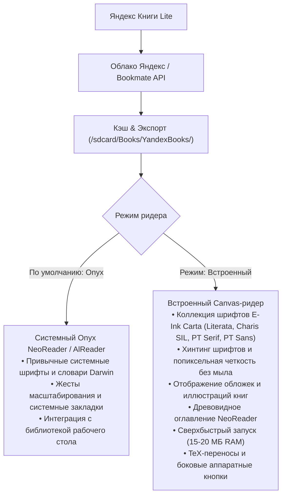

<p align="center">
  
</p>

# 📚 Яндекс Книги Lite для Onyx Boox

[](https://github.com/litvaerickson-spec/onyx-yandex-books/releases/latest)
[](https://github.com/litvaerickson-spec/onyx-yandex-books)
[](https://github.com/litvaerickson-spec/onyx-yandex-books)
[]()
[](LICENSE)

> **Автономный легковесный клиент сервиса «Яндекс Книги»** для электронных книг Onyx Boox (Darwin, Vasco da Gama, Faust, Monte Cristo, Livingstone и др.) на базе Android 4.2 / 4.4 с поддержкой современных протоколов TLS 1.3, облачной синхронизацией, **коллекцией эталонных E-Ink шрифтов (Literata, Charis SIL, PT Serif, PT Sans)** с хинтингом, **диалогом выбора шрифта с превью**, **точным пакетным офлайн-скачиванием полок**, **ночным режимом (E-Ink Dark Mode)**, **каталогом и глобальным поиском**, **сохранением ручного распределения полок**, **сбросом прочитанного до 0%**, **полусинхронизацией прогресса с другими устройствами через закладки**, **бесшовным встроенным OTA-обновлением с GitHub**, отображением **обложек и внутренних иллюстраций**, древовидным оглавлением в стиле Onyx NeoReader, строгим E-Ink дизайном по канонам ридеров без тяжелых черных заливок и визуального шума.

> [!IMPORTANT]
> **⚖️ Правовой статус и отказ от ответственности / Legal Disclaimer & Educational Use:**
> Данный проект является **неофициальным открытым клиентом для личного некоммерческого использования** подписчиками сервиса «Яндекс Книги» на аппаратных ридерах E-Ink (Onyx Boox), где официальное приложение технически не поддерживается (требует Android 7+).
> 
> * **Отсутствие пиратского контента:** Настоящий репозиторий и приложение **НЕ содержат, НЕ хранят, НЕ распространяют и НЕ предоставляют несанкционированного доступа** к электронным книгам, текстам, аудиокнигам или иным произведениям, защищенным авторским правом. Репозиторий содержит исключительно открытый исходный код клиента.
> * **Легальный доступ через официальный аккаунт:** Загрузка и чтение книг производятся **исключительно через официальный протокол авторизации Яндекс ID (OAuth RFC 8628)** под личной учетной записью пользователя и только при наличии у него **действующей официальной подписки «Яндекс Плюс» / «Яндекс Книги»**. Приложение не содержит средств обхода технических мер защиты (DRM), генераторов ключей, средств взлома или модификации серверных ответов.
> * **Торговые марки:** Все товарные знаки «Яндекс», «Яндекс Книги», «Букмейт», «Yandex», логотипы и названия сервисов принадлежат ООО «Яндекс» и соответствующим правообладателям. Разработчик проекта никоим образом не аффилирован с ООО «Яндекс».
> * **Лицензия и отказ от ответственности:** Исходный код распространяется по лицензии MIT «как есть» (AS IS). Разработчик не несет ответственности за нецелевое использование приложения третьими лицами или возможное нарушение Пользовательского соглашения сервисов Яндекса.

---

### 📥 Загрузка и установка

* 🚀 **Свежая версия на GitHub**: [**Страница последнего релиза (Releases / Latest)**](https://github.com/litvaerickson-spec/onyx-yandex-books/releases/latest)
* 🔄 **Встроенное OTA-обновление**: прямо из приложения в один клик через кнопку `[ Обновить ]` в шапке или клик по версии внизу!
* 🔨 **Скрипт сборки из исходников**: [`build_apk.sh`](build_apk.sh)

---

## 📊 Сравнение: Официальный клиент vs E-Ink Edition

| Параметр | Официальное приложение «Яндекс Книги» | Яндекс Книги Lite (Наш клиент) |
| :--- | :--- | :--- |
| **Поддержка Android 4.2–4.4** | ❌ Не устанавливается (требует Android 7+) | ✅ **Полная нативная совместимость** |
| **Потребление ОЗУ (RAM)** | ⚠️ 280–340 МБ (OOM вылеты и краши) | 🚀 **15–20 МБ (0 лагов, плавная работа)** |
| **Движок рендеринга** | Тяжелый Chromium Content Shell / WebView | 100% нативный **Canvas / StaticLayout + Графика** |
| **Обложки и иллюстрации** | Медленный веб-рендеринг | **Аппаратный RGB_565 растр с дискретной пагинацией** |
| **Оглавление книги** | Стандартный плоский веб-список | **Интерактивное древовидное TOC NeoReader (части, главы)** |
| **Управление полками** | Требует тяжелых анимаций | **Быстрые кнопки: «Читаю», «В планы», «Прочитано»** |
| **Сброс прочитанного** | ❌ Недоступен в интерфейсе | **Кнопка «Сбросить чтение» (0%, очистка закладок)** |
| **Полусинхронизация** | ❌ Нет для сторонних ридеров | **Автозакладки «Облако (XX%)» + передача позиции в ридеры** |
| **Авторизация на E-Ink** | Ввод пароля с виртуальной клавиатуры | **В 1 клик по QR-коду со смартфона / ya.ru/device** |
| **Сетевой стек** | Системный SSL (устарел на Android 4.x) | **Google Conscrypt (BoringSSL JNI, TLS 1.2/1.3)** |
| **Типографика** | Базовая веб-разметка | **Слоговые переносы TeX (Франклин-Лян), Justify** |
| **Аппаратные кнопки ридера** | Не поддерживаются | **Аппаратный перехват кнопок Onyx Boox** |
| **Очистка артефактов E-Ink** | ❌ Нет (серый налет и мыло) | ✅ **Многоуровневый EPD-сброс остаточных чернил** |
| **Обновление по воздуху (OTA)**| Google Play (недоступен) | **Встроенный OTA-апдейтер с GitHub в 1 клик** |

---

## 🌟 Ключевые возможности приложения

### 📖 Адаптированное чтение для E-Ink Carta
- **Эталонные шрифты ридеров (100% офлайн)**: в бандл встроены проверенные гарнитуры **Literata** (фирменный шрифт Google для ридеров), **Charis SIL** (легендарный контрастный шрифт KOReader/AlReader), **PT Serif** (классический русский книжный с засечками от ПараТайп) и **PT Sans** (рубленый гротеск).
- **Максимальная четкость и аппаратный хинтинг**: включен FreeType/Skia хинтинг (`Paint.HINTING_ON`), отключено субпиксельное мыло, а координаты вывода текста жестко привязаны к физической сетке пикселей дисплея.
- **Интерактивный диалог выбора шрифта**: быстрое переключение гарнитур с живыми образцами текста и пояснениями.
- **Обложки и внутренние иллюстрации**: автоматическое декодирование графики в экономичный растр `RGB_565` с выделением рисунков на отдельные экраны.
- **Древовидное оглавление**: иерархический навигатор по частям и главам в стиле Onyx NeoReader с расчетом сквозных номеров страниц.
- **Инверсный ночной режим (E-Ink Dark Mode)**: чтение белым текстом по черному фону с аппаратным сбросом чернил.
- **Слоговые переносы и Justify**: алгоритм Франклина-Ляна (TeX) для идеальной верстки без «дыр» в строках.

### 📚 Управление библиотекой и синхронизация
- **Три основные полки**: «Читаю», «В планах» и «Прочитано» с мгновенным переключением.
- **Надежное ручное распределение**: перемещение книг между полками сохраняется персистентно и не сбрасывается облаком.
- **Пакетное скачивание («Скачать полку»)**: синхронная фоновая загрузка всей полки целиком для чтения без интернета.
- **Полусинхронизация прогресса**: автоматическое создание закладок «Облако (XX%)» и передача позиции чтения в системные ридеры Onyx через Intent Extras.
- **Действие «Сбросить чтение»**: возможность обнулить прочитанное до 0% и очистить закладки в один клик.
- **Каталог и глобальный поиск**: поиск по каталогу Яндекс Книг через GraphQL API.

### ⚡ Техническое совершенство под Android 4.x KitKat
- **Потребление ОЗУ всего 15–20 МБ**: плавная работа без риска OOM даже на одноядерных чипсетах Rockchip.
- **Современный стек TLS 1.2 / TLS 1.3**: безопасные шифры через Google Conscrypt (BoringSSL JNI).
- **Аппаратный сброс артефактов E-Ink (EPD Refresh)**: чистый экран без остаточных теней (ghosting).
- **Авторизация по QR-коду**: вход в 1 клик со смартфона без ввода паролей на E-Ink клавиатуре.
- **Встроенное OTA-обновление**: автоматическая проверка свежих версий с GitHub и обновление в один клик.

> 📋 Подробную историю изменений по каждому выпуску смотрите в [CHANGELOG.md](CHANGELOG.md).

---

## 📱 Поддерживаемые устройства

| Линейка устройств | ОС Android | Экран | Управление |
|---|---|---|---|
| **Onyx Boox Darwin (1, 2, 3)** | Android 4.2.2 (API 17) | 1024×758 E-Ink Carta | Сенсорный экран + физические боковые кнопки листания |
| **Onyx Boox Darwin (4, 5, 6)** | Android 4.4.4 (API 19) | 1024×758 / 1448×1072 Carta | Сенсорный экран + физические боковые кнопки листания |
| **Onyx Boox Vasco da Gama (1, 2, 3)** | Android 4.4.4 (API 19) | 1024×758 E-Ink Carta | Сенсорный экран + боковые кнопки |
| **Onyx Boox Faust, Monte Cristo, Caesar** | Android 4.2 / 4.4 | E-Ink Carta | Сенсорный экран / кнопки |
| **Любые ридеры и планшеты Android 4.2–11.0+** | Android 4.2+ (API 17+) | Любое разрешение | Сенсор или аппаратные клавиши |

---

## 🎯 Архитектура двух ридеров: выбор под любые задачи



---

## 📲 Порядок установки и обновления

1. Загрузите APK со страницы [**последнего релиза (Releases / Latest)**](https://github.com/litvaerickson-spec/onyx-yandex-books/releases/latest).
2. Скопируйте APK в память ридера (через USB или MicroSD-карту).
3. На ридере откройте **«Диспетчер файлов»** и нажмите на файл для установки.
4. Приложение обновится поверх существующей версии — авторизация и скачанные книги сохранятся.
   *(Или воспользуйтесь кнопкой обновления прямо внутри приложения!)*

---

## 📂 Структура проекта

```text
01_onyx_yandex_books/
├── README.md               # Главная страница и руководство проекта
├── CHANGELOG.md            # Детальная история версий (Keep a Changelog)
├── DEV_LOG.md              # Инженерный журнал разработки
├── build_apk.sh            # Скрипт сборки и подписи релизного APK
├── tools/                  # Автоматические тесты ядра (verify_core_logic.py)
├── .github/workflows/      # Автоматизация релизов (Telegram notifier)
├── docs/                   # Архитектурные спецификации и руководство пользователя
│   ├── guides/             # Руководства пользователя
│   ├── research/           # Исследования TLS и API
│   └── specs/              # Архитектурные спецификации
├── app/                    # Исходный код Android приложения
└── libs/                   # Локальные библиотеки
```

---

## 📄 Лицензия и правовая информация (Legal & DMCA Compliance)

- **Лицензия:** Исходный код проекта распространяется на условиях свободной лицензии [MIT License](LICENSE).
- **Соответствие законодательству и авторскому праву:**
  - Настоящий проект не нарушает Федеральный закон «Об информации, информационных технологиях и о защите информации», Гражданский кодекс РФ (часть IV) и нормы DMCA, так как не осуществляет хранение, ретрансляцию или распространение объектов авторских и смежных прав.
  - Приложение является исключительно независимым клиентом интерфейса отображения данных, аналогично веб-браузерам.
  - Любой обмен данными происходит исключительно между официальными серверами правообладателя (сервисы Яндекса) и локальным устройством конечного пользователя по защищенным каналам с использованием аутентификационных токенов пользователя.
  - В случае возникновения любых правовых вопросов проект готов к конструктивному взаимодействию с правообладателями.
