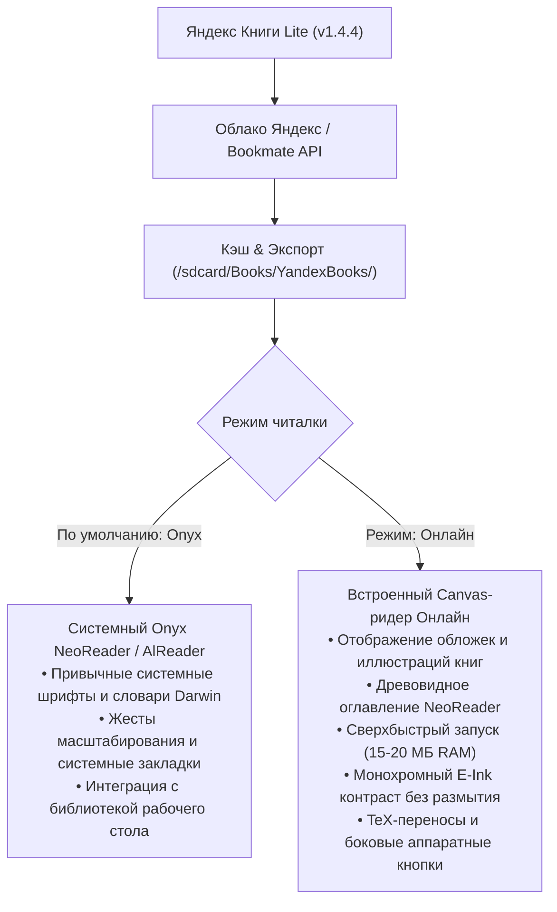

<p align="center">
  
</p>

# 📚 Яндекс Книги Lite для Onyx Boox (v1.4.4)

[](https://github.com/litvaerickson-spec/onyx-yandex-books/releases/tag/v1.4.4)
[](https://github.com/litvaerickson-spec/onyx-yandex-books)
[](https://github.com/litvaerickson-spec/onyx-yandex-books)
[]()
[](https://github.com/litvaerickson-spec/onyx-yandex-books/releases/download/v1.4.4/yandex-books-lite-v1.4.4.apk)

> **Автономный легковесный клиент сервиса «Яндекс Книги»** для электронных книг Onyx Boox (Darwin, Vasco da Gama, Faust, Monte Cristo, Livingstone и др.) на базе Android 4.2 / 4.4 с поддержкой современных протоколов TLS 1.3, облачной синхронизацией, **каталогом и глобальным поиском**, **бесшовным встроенным OTA-обновлением с GitHub**, отображением **обложек и внутренних иллюстраций**, древовидным оглавлением в стиле Onyx NeoReader, управлением полками и строгим E-Ink дизайном по канонам ридеров без смайликов и визуального шума.

---

### 📥 Быстрая загрузка и установка

* 🚀 **Официальный релиз v1.4.4 на GitHub**: [**Страница релиза v1.4.4**](https://github.com/litvaerickson-spec/onyx-yandex-books/releases/tag/v1.4.4)
* 📦 **Прямая ссылка на APK**: [**`yandex-books-lite-v1.4.4.apk`**](https://github.com/litvaerickson-spec/onyx-yandex-books/releases/download/v1.4.4/yandex-books-lite-v1.4.4.apk) *(2.26 МБ, цифровая подпись v1/v2/v3, готов к установке поверх предыдущей версии)*
* 🔄 **Встроенное OTA-обновление**: прямо из приложения в один клик через кнопку `[ Обновить ]` в шапке или клик по версии внизу!
* 🔨 **Скрипт сборки из исходников**: [`build_apk.sh`](build_apk.sh)

---

## 📊 Сравнение: Официальный клиент vs E-Ink Edition

| Параметр | Официальное приложение «Яндекс Книги» | Яндекс Книги Lite (Наш клиент) |
| :--- | :--- | :--- |
| **Поддержка Android 4.2–4.4** | ❌ Не устанавливается (требует Android 7+) | ✅ **Полная нативная совместимость** |
| **Потребление ОЗУ (RAM)** | ⚠️ 280–340 МБ (OOM вылеты и краши) | 🚀 **15–20 МБ (0 лагов, плавная работа)** |
| **Движок рендеринга** | Тяжелый Chromium Content Shell / WebView | 100% нативный **Canvas / StaticLayout + Графика** |
| **Обложки и иллюстрации** | Медленный веб-рендеринг | **Аппаратный RGB_565 растр с дискретной пагинацией** |
| **Оглавление книги** | Стандартный плоский веб-список | **Интерактивное древовидное TOC NeoReader (части, главы)** |
| **Управление полками** | Требует тяжелых анимаций | **Быстрые кнопки: «Читаю», «В планы», «Прочитано»** |
| **Авторизация на E-Ink** | Ввод пароля с виртуальной клавиатуры | **В 1 клик по QR-коду со смартфона / ya.ru/device** |
| **Сетевой стек** | Системный SSL (устарел на Android 4.x) | **Google Conscrypt (BoringSSL JNI, TLS 1.2/1.3)** |
| **Типографика** | Базовая веб-разметка | **Слоговые переносы TeX (Франклин-Лян), Justify** |
| **Аппаратные кнопки читалки** | Не поддерживаются | **Аппаратный перехват кнопок Onyx Boox** |
| **Очистка артефактов E-Ink** | ❌ Нет (серый налет и мыло) | ✅ **Многоуровневый EPD-сброс остаточных чернил** |
| **Обновление по воздуху (OTA)**| Google Play (недоступен) | **Встроенный OTA-апдейтер с GitHub в 1 клик** |

---

## 🌟 Главные новшества последних релизов (v1.4.0 – v1.4.4)

1. **⚡ Переработка архитектуры чтения и ликвидация багов (v1.4.4)**:
   - **Устранение критической потери текста глав**: ликвидирован баг срезки закрывающих тегов разметки, стиравший содержимое глав и вызывавший пустые экраны с одиночными заголовками `[Ивон]`. 100% текста книги гарантированно сохраняется и отображается.
   - **Мгновенное перелистывание (<5 мс)**: внедрен оперативный LRU-кэш разбивки страниц и фоновая упреждающая пагинация соседних глав (+1/-1); устранены фризы до 5-10 секунд и пропуск нажатий.
   - **Синхронизация прогресса и номеров страниц**: процент прочитанного жестко привязан к сквозным номерам страниц книги `(текущая / всего * 100)`.
   - **Подлинные названия глав в колонтитуле**: динамический матчинг с деревом оглавления книги (TOC) вместо служебных имен `ch_1`.
   - **Автоматическое самовосстановление кэша**: поврежденные ранее главы автоматически восстанавливаются при открытии книги без повторной загрузки.
   - **Новый E-Ink логотип и иконка**: контрастная контурная буква «Я» с надписью «КНИГИ» в скругленной карточке с кантом.
   - **Чистая структура репозитория**: корень проекта очищен от разрозненных файлов релизов, история полностью консолидирована в `CHANGELOG.md`.
2. **⚡ Мгновенное открытие книг и отзывчивое листание (v1.4.3)**:
   - **Мгновенный старт (<50 мс)**: книги с сохраненными главами открываются без задержки и без повторной распаковки архива.
   - **Исправление жестов листания**: смахивание влево листает вперед, вправо — назад; ликвидированы «мертвые зоны» между свайпами и тапами.
   - **Защита от гонок многопоточности**: барьер `isPaginating` устраняет рассинхронизацию глав при частых кликах.
   - **Фоновое чтение глав**: чтение файлов вынесено из главного UI-потока в фоновый пул `paginationExecutor`.
   - **Подавление автоповтора клавиш**: устранено пролистывание пачками страниц при зажатии боковых аппаратных кнопок.
3. **🖼️ Обложки книг и встроенные иллюстрации (v1.4.2)**:
   - **Титульная обложка**: гарантированное извлечение из OPF манифеста EPUB и показ на Странице 0 книги.
   - **Книжные схемы и иллюстрации**: теги `` и `<image>` транслируются в маркеры `[IMG:path]`.
   - **Дискретная пагинация графики**: автоматическое выделение изображений на отдельные полноэкранные страницы.
   - **Бережное декодирование под 512 МБ RAM**: растр в формате `Bitmap.Config.RGB_565` с автоматическим `inSampleSize`.
4. **📚 Интерактивное управление полками в деталях книги (v1.4.1)**:
   - Кнопки `[ Читаю ]`, `[ В планы ]`, `[ Прочитано ]` с подсветкой текущей полки.
   - Опция «Убрать с полки» и «Удалить файл» для освобождения внутренней памяти ридера.
   - Автоматический перевод открытых книг в раздел «Читаю».
5. **📑 Древовидное иерархическое оглавление NeoReader (v1.4.0)**:
   - Интерактивное раскрытие ветвей (`▽` / `▶`), поддержка многоуровневых книг (части, разделы, главы).
   - Сквозные расчетные номера страниц книги напротив каждого пункта оглавления.
5. **🧹 Аппаратная самоочистка экрана (EPD / E-Ink Refresh) и персистентный диалог сети (v1.3.9)**:
   - Полная ликвидация артефактов и «гостинга» на чипсетах Rockchip RK3026/RK3128.
   - Удобный диалог «Интернет не подключен» с возможностью повтора.

---

## 📱 Поддерживаемые устройства

| Линейка устройств | ОС Android | Экран | Управление |
|---|---|---|---|
| **Onyx Boox Darwin (1, 2, 3)** | Android 4.2.2 (API 17) | 1024×758 E-Ink Carta | Сенсорный экран + физические боковые кнопки листания |
| **Onyx Boox Darwin (4, 5, 6)** | Android 4.4.4 (API 19) | 1024×758 / 1448×1072 Carta | Сенсорный экран + физические боковые кнопки листания |
| **Onyx Boox Vasco da Gama (1, 2, 3)** | Android 4.4.4 (API 19) | 1024×758 E-Ink Carta | Сенсорный экран + боковые кнопки |
| **Onyx Boox Faust, Monte Cristo, Caesar** | Android 4.2 / 4.4 | E-Ink Carta | Сенсорный экран / кнопки |
| **Любые ридеры и планшеты Android 4.2–11.0+** | Android 4.2+ (API 17+) | Любое разрешение | Сенсор или аппаратные клавиши |

---

## 🎯 Архитектура двух читалок: выбор под любые задачи



---

## 📲 Порядок установки и обновления

1. Загрузите файл **[`yandex-books-lite-v1.4.4.apk`](https://github.com/litvaerickson-spec/onyx-yandex-books/releases/download/v1.4.4/yandex-books-lite-v1.4.4.apk)**.
2. Скопируйте APK в память ридера (через USB или MicroSD-карту).
3. На ридере откройте **«Диспетчер файлов»** и нажмите на файл для установки.
4. Приложение обновится поверх существующей версии — авторизация и скачанные книги сохранятся.
   *(Или воспользуйтесь кнопкой обновления прямо внутри приложения!)*

---

## 📂 Структура проекта

```text
01_onyx_yandex_books/
├── README.md               # Главная страница и руководство проекта (v1.4.4)
├── CHANGELOG.md            # Детальная история версий (Keep a Changelog)
├── DEV_LOG.md              # Инженерный журнал разработки
├── build_apk.sh            # Скрипт сборки и подписи релизного APK
├── tools/                  # Автоматические тесты ядра (verify_core_logic.py)
├── .github/workflows/      # Автоматизация релизов (Telegram notifier)
├── docs/                   # Архитектурные спецификации и руководство пользователя
│   ├── guides/             # Руководства пользователя
│   ├── research/           # Исследования TLS и API
│   └── specs/              # Архитектурные спецификации
├── app/                    # Исходный код Android приложения
└── libs/                   # Локальные библиотеки
```

---

## 📄 Лицензия и статус

Проект развивается открыто для сообщества владельцев ридеров Onyx Boox под лицензией MIT. Все торговые марки «Яндекс» и «Яндекс Книги» принадлежат их законным правообладателям.
