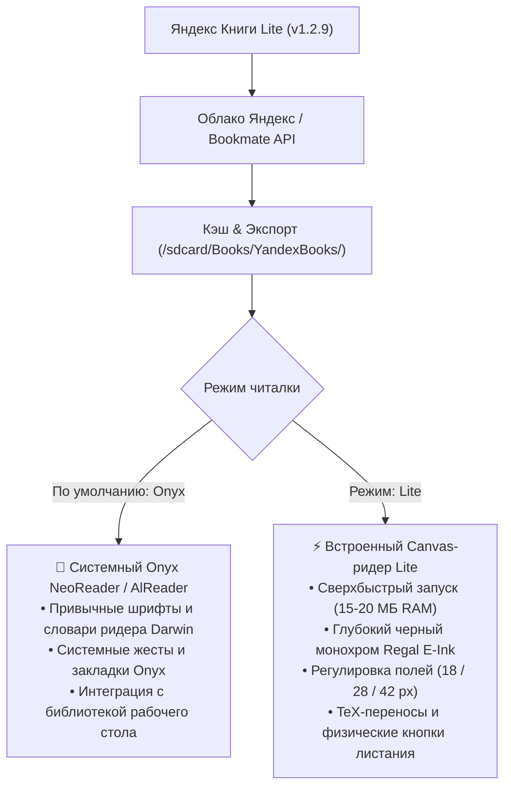

# 📚 Яндекс Книги Lite для Onyx Boox (v1.3.0)

[](https://github.com/litvaerickson-spec/onyx-yandex-books/releases/tag/v1.3.0)
[](https://github.com/litvaerickson-spec/onyx-yandex-books)
[](https://github.com/litvaerickson-spec/onyx-yandex-books)
[](https://github.com/litvaerickson-spec/onyx-yandex-books/releases/download/v1.3.0/yandex-books-lite-v1.3.0.apk)

> **Автономный легковесный клиент сервиса «Яндекс Книги»** для электронных книг Onyx Boox (Darwin, Vasco da Gama, Faust, Monte Cristo, Livingstone и др.) на базе Android 4.2 / 4.4 с поддержкой современных протоколов TLS 1.3, облачной синхронизацией, **бесшовным встроенным OTA-обновлением с GitHub**, интеграцией со штатной читалкой Onyx NeoReader и эргономичным E-Ink интерфейсом по канонам ридеров.

---

### 📥 Быстрая загрузка и установка

* 🚀 **Официальный релиз v1.3.0 на GitHub**: [**Страница релиза v1.3.0**](https://github.com/litvaerickson-spec/onyx-yandex-books/releases/tag/v1.3.0)
* 📦 **Прямая ссылка на APK**: [**`yandex-books-lite-v1.3.0.apk`**](https://github.com/litvaerickson-spec/onyx-yandex-books/releases/download/v1.3.0/yandex-books-lite-v1.3.0.apk) *(2.2 МБ, цифровая подпись v1/v2/v3, готов к установке поверх предыдущей версии)*
* 🔄 **Встроенное OTA-обновление**: начиная с версии 1.3.0, обновляться до новых релизов можно прямо из интерфейса книги в один клик (кнопка `[ ⬆ Обн. ]` в шапке или клик по версии внизу). Все данные, книги и авторизация сохраняются!
* 🔨 **Скрипт сборки из исходников**: [`build_apk.sh`](build_apk.sh)

---

## 🌟 Главные новшества версии 1.3.0

1. **🚀 Встроенное OTA-обновление прямо из читалки с GitHub Releases**:
   - Автоматическая проверка свежих версий при запуске и кнопка `[ ⬆ Обн. ]` в шапке.
   - Скачивание APK потоком с индикацией прогресса и автоматический запуск нативного установщика Android.
   - **Никаких потерь данных**: установка поверх существующей версии гарантированно сохраняет базу данных SQLite, книги, токены и прогресс чтения без необходимости повторного входа!
2. **🎨 Полная эргономическая переработка диалогового окна «О книге»**:
   - Окно занимает 92% ширины и 85% высоты E-Ink экрана.
   - **Аннотация книги занимает более 60% высоты**: 14–16 строк текста с комфортным межстрочным интервалом 1.2 вместо прежних 3 строчек.
   - Название и метаданные автора/прогресса сжаты в аккуратную компактную шапку.
   - Блок действий организован в 2 компактные горизонтальные строки:
     - Строка 1: кнопки чтения бок о бок (50% / 50%): `[ 📖 Onyx Reader ]` и `[ ⚡ Читалка Lite ]`.
     - Строка 2: кнопки скачивания/статуса и закрытия: `[ 📥 Скачать EPUB ]` / `✔ В памяти` и `[ ✕ Закрыть ]`.
3. **🔄 Надежная облачная синхронизация прогресса со смартфона**:
   - Парсинг многоуровневых структур Bookmate API (`last_reading_position`, `reading_position`, `position`, `percent`, `progress`).
   - Автоматический расчет точного номера главы и параграфа с открытием страницы прямо на месте чтения.
4. **🎨 Гармоничный E-Ink редизайн меню читалки Lite (сетка 2×2)**:
   - Кнопки настроек ридера в сетке 2×2 с крупным шрифтом 12sp bold без разрыва слов по слогам.
5. **🏛️ Фиксированная нижняя статус-панель полок и поддержка физических кнопок Darwin**:
   - Аккуратный E-Ink статус-бар (30dp) со счетчиком книг `📚 Книг: X • v1.3.0` и постраничной навигацией `[ ◀ Стр ]  1/1  [ Стр ▶ ]`.
   - Листание списков физическими кнопками Darwin (`PAGE_UP`/`PAGE_DOWN`).

---

## 📱 Поддерживаемые устройства

| Линейка устройств | ОС Android | Экран | Управление |
|---|---|---|---|
| **Onyx Boox Darwin (1, 2, 3)** | Android 4.2.2 (API 17) | 1024×758 E-Ink Carta | Сенсорный экран + физические боковые кнопки листания |
| **Onyx Boox Darwin (4, 5, 6)** | Android 4.4.4 (API 19) | 1024×758 / 1448×1072 Carta | Сенсорный экран + физические боковые кнопки листания |
| **Onyx Boox Vasco da Gama (1, 2, 3)** | Android 4.4.4 (API 19) | 1024×758 E-Ink Carta | Сенсорный экран + боковые кнопки |
| **Onyx Boox Faust, Monte Cristo, Caesar** | Android 4.2 / 4.4 | E-Ink Carta | Сенсорный экран / кнопки |
| **Любые ридеры и планшеты Android 4.2–9.0+** | Android 4.2+ (API 17+) | Любое разрешение | Сенсор или аппаратные клавиши |

---

## 🎯 Архитектура двух читалок: выбор под любые задачи



---

## 📲 Порядок установки и обновления

1. Загрузите файл **[`yandex-books-lite-v1.2.9.apk`](https://github.com/litvaerickson-spec/onyx-yandex-books/releases/download/v1.2.9/yandex-books-lite-v1.2.9.apk)**.
2. Скопируйте APK в память ридера (через USB или MicroSD-карту).
3. На ридере откройте **«Диспетчер файлов»** и нажмите на файл для установки.
4. Приложение обновится поверх существующей версии — авторизация и скачанные книги сохранятся.

---

## 📂 Структура проекта

```text
01_onyx_yandex_books/
├── README.md               # Главная страница и руководство проекта
├── CHANGELOG.md            # Детальная история версий (Keep a Changelog)
├── DEV_LOG.md              # Инженерный журнал разработки
├── build_apk.sh            # Скрипт сборки и подписи релизного APK
├── release_notes_v1.2.9.md # Описание релиза v1.2.9
├── app/
│   ├── build.gradle        # Конфигурация Android сборки
│   └── src/main/
│       ├── AndroidManifest.xml
│       ├── java/com/onyx/yandexbooks/
│       │   ├── core/api/       # Клиент Bookmate / Yandex API
│       │   ├── core/auth/      # Авторизация (Device Code, QR, TLS)
│       │   ├── core/eink/      # Контроллер обновления EPD и аппаратные кнопки
│       │   ├── core/network/   # Conscrypt TLS 1.3 и HTTP-клиент
│       │   ├── core/storage/   # SQLite БД, кэш EPUB, экспорт в Books, AppSettings
│       │   ├── core/sync/      # Двусторонняя облачная синхронизация прогресса
│       │   ├── core/typography/# TeX переносы, пагинация, шрифты и поля
│       │   └── ui/             # Активности, адаптеры и ReaderCanvasView
│       └── res/                # Разметка интерфейса и монохромные E-Ink ресурсы
└── docs/                       # Архитектурные спецификации и исследования
```

---

## 📄 Лицензия и статус

Проект развивается открыто для владельцев ридеров Onyx Boox. Все торговые марки «Яндекс» и «Яндекс Книги» принадлежат их законным правообладателям.
