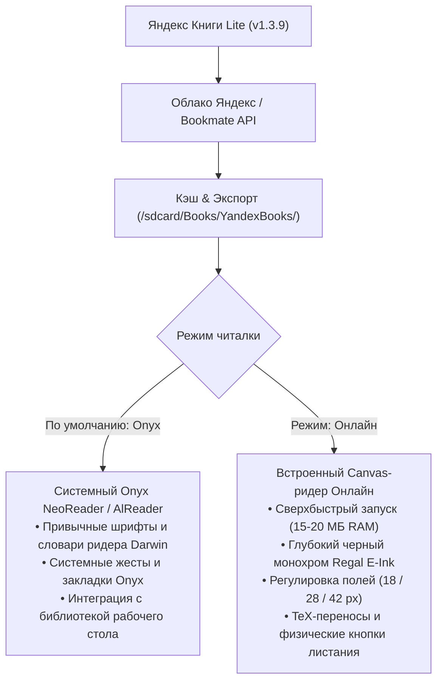

# 📚 Яндекс Книги Lite для Onyx Boox (v1.3.9)

[](https://github.com/litvaerickson-spec/onyx-yandex-books/releases/tag/v1.3.9)
[](https://github.com/litvaerickson-spec/onyx-yandex-books)
[](https://github.com/litvaerickson-spec/onyx-yandex-books)
[]()
[](https://github.com/litvaerickson-spec/onyx-yandex-books/releases/download/v1.3.9/yandex-books-lite-v1.3.9.apk)

> **Автономный легковесный клиент сервиса «Яндекс Книги»** для электронных книг Onyx Boox (Darwin, Vasco da Gama, Faust, Monte Cristo, Livingstone и др.) на базе Android 4.2 / 4.4 с поддержкой современных протоколов TLS 1.3, облачной синхронизацией, **каталогом и глобальным поиском**, **бесшовным встроенным OTA-обновлением с GitHub**, расширенным интерфейсом читалки в стиле Onyx NeoReader и строгим E-Ink дизайном по канонам ридеров без смайликов и визуального шума.

---

### 📥 Быстрая загрузка и установка

* 🚀 **Официальный релиз v1.3.9 на GitHub**: [**Страница релиза v1.3.9**](https://github.com/litvaerickson-spec/onyx-yandex-books/releases/tag/v1.3.9)
* 📦 **Прямая ссылка на APK**: [**`yandex-books-lite-v1.3.9.apk`**](https://github.com/litvaerickson-spec/onyx-yandex-books/releases/download/v1.3.9/yandex-books-lite-v1.3.9.apk) *(2.2 МБ, цифровая подпись v1/v2/v3, готов к установке поверх предыдущей версии)*
* 🔄 **Встроенное OTA-обновление**: прямо из приложения в один клик через кнопку `[ Обновить ]` в шапке или клик по версии внизу!
* 🔨 **Скрипт сборки из исходников**: [`build_apk.sh`](build_apk.sh)

---

## 📊 Сравнение: Официальный клиент vs E-Ink Edition

| Параметр | Официальное приложение «Яндекс Книги» | Яндекс Книги Lite (Наш клиент) |
| :--- | :--- | :--- |
| **Поддержка Android 4.2–4.4** | ❌ Не устанавливается (требует Android 7+) | ✅ **Полная нативная совместимость** |
| **Потребление ОЗУ (RAM)** | ⚠️ 280–340 МБ (OOM вылеты и краши) | 🚀 **15–20 МБ (0 лагов, плавная работа)** |
| **Движок рендеринга** | Тяжелый Chromium Content Shell / WebView | 100% нативный **Canvas / StaticLayout** |
| **Авторизация на E-Ink** | Ввод пароля с виртуальной клавиатуры | **В 1 клик по QR-коду со смартфона / ya.ru/device** |
| **Сетевой стек** | Системный SSL (устарел на Android 4.x) | **Google Conscrypt (BoringSSL JNI, TLS 1.2/1.3)** |
| **Типографика** | Базовая веб-разметка | **Слоговые переносы TeX (Франклин-Лян), Justify** |
| **Аппаратные кнопки читалки** | Не поддерживаются | **Аппаратный перехват кнопок Onyx Boox** |
| **Очистка артефактов E-Ink** | ❌ Нет (серый налет и мыло) | ✅ **Многоуровневый EPD-сброс остаточных чернил** |
| **Обновление по воздуху (OTA)**| Google Play (недоступен) | **Встроенный OTA-апдейтер с GitHub в 1 клик** |

---

## 🌟 Главные новшества версии 1.3.9

1. **📶 Персистентный диалог отсутствия интернета**:
   - При открытии каталога или попытке поиска без активного Wi-Fi больше нет мгновенно исчезающих Toast-сообщений.
   - Полноценный модальный E-Ink диалог с кнопками «Повторить попытку» и «Закрыть».
2. **🧹 Аппаратная самоочистка экрана (EPD / E-Ink Refresh)**:
   - Полная ликвидация артефактов и «гостинга» от предыдущих окон.
   - Поддержка нативной рефлексии Onyx SDK для чипсетов Rockchip RK3026/RK3128 (Darwin 3, Darwin 5) и рассылка системных широковещательных интентов (`action.screen.refresh`, `onyx.intent.action.FULL_SCREEN_REFRESH`).
   - Срабатывание при открытии книги, закрытии меню и диалогов оглавления.
3. **📑 Подлинное якорное оглавление (TOC Anchors)**:
   - Поддержка книг, где несколько частей упакованы издателем в единый файл spine. Корректная нарезка по якорям (`id`, `name`) и заголовкам.
   - Автоматическая быстрая локальная миграция ранее скачанных книг.
4. **📏 Оптимизация нижнего отступа над строкой статуса**:
   - Суммарная резервируемая высота футера сокращена с 64px до 26px — на странице помещается больше полезного текста при сохранении гармоничного зазора.

---

## 📱 Поддерживаемые устройства

| Линейка устройств | ОС Android | Экран | Управление |
|---|---|---|---|
| **Onyx Boox Darwin (1, 2, 3)** | Android 4.2.2 (API 17) | 1024×758 E-Ink Carta | Сенсорный экран + физические боковые кнопки листания |
| **Onyx Boox Darwin (4, 5, 6)** | Android 4.4.4 (API 19) | 1024×758 / 1448×1072 Carta | Сенсорный экран + физические боковые кнопки листания |
| **Onyx Boox Vasco da Gama (1, 2, 3)** | Android 4.4.4 (API 19) | 1024×758 E-Ink Carta | Сенсорный экран + боковые кнопки |
| **Onyx Boox Faust, Monte Cristo, Caesar** | Android 4.2 / 4.4 | E-Ink Carta | Сенсорный экран / кнопки |
| **Любые ридеры и планшеты Android 4.2–11.0+** | Android 4.2+ (API 17+) | Любое разрешение | Сенсор или аппаратные клавиши |

---

## 🎯 Архитектура двух читалок: выбор под любые задачи



---

## 📲 Порядок установки и обновления

1. Загрузите файл **[`yandex-books-lite-v1.3.9.apk`](https://github.com/litvaerickson-spec/onyx-yandex-books/releases/download/v1.3.9/yandex-books-lite-v1.3.9.apk)**.
2. Скопируйте APK в память ридера (через USB или MicroSD-карту).
3. На ридере откройте **«Диспетчер файлов»** и нажмите на файл для установки.
4. Приложение обновится поверх существующей версии — авторизация и скачанные книги сохранятся.
   *(Или воспользуйтесь кнопкой обновления прямо внутри приложения!)*


---

## 📂 Структура проекта

```text
01_onyx_yandex_books/
├── README.md               # Главная страница и руководство проекта (v1.3.9)
├── CHANGELOG.md            # Детальная история версий (Keep a Changelog)
├── DEV_LOG.md              # Инженерный журнал разработки
├── build_apk.sh            # Скрипт сборки и подписи релизного APK
├── release_notes_v1.3.9.md # Описание релиза v1.3.9
├── .github/workflows/      # Автоматизация релизов (Telegram notifier)
├── docs/                   # Архитектурные спецификации и руководство пользователя
│   ├── guides/             # Руководства пользователя
│   ├── research/           # Исследования TLS и API
│   └── specs/              # Архитектурные спецификации
├── app/                    # Исходный код Android приложения
└── libs/                   # Локальные библиотеки
```

---

## 📄 Лицензия и статус

Проект развивается открыто для сообщества владельцев ридеров Onyx Boox под лицензией MIT. Все торговые марки «Яндекс» и «Яндекс Книги» принадлежат их законным правообладателям.
