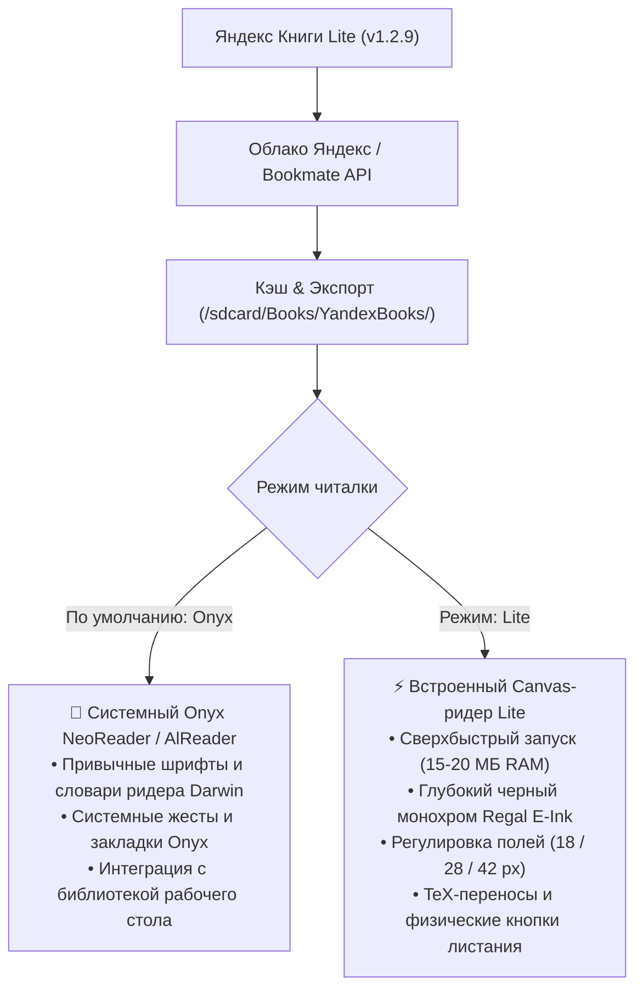

# 📚 Яндекс Книги Lite для Onyx Boox (v1.3.1)

[](https://github.com/litvaerickson-spec/onyx-yandex-books/releases/tag/v1.3.1)
[](https://github.com/litvaerickson-spec/onyx-yandex-books)
[](https://github.com/litvaerickson-spec/onyx-yandex-books)
[](https://github.com/litvaerickson-spec/onyx-yandex-books/releases/download/v1.3.1/yandex-books-lite-v1.3.1.apk)

> **Автономный легковесный клиент сервиса «Яндекс Книги»** для электронных книг Onyx Boox (Darwin, Vasco da Gama, Faust, Monte Cristo, Livingstone и др.) на базе Android 4.2 / 4.4 с поддержкой современных протоколов TLS 1.3, облачной синхронизацией, **бесшовным встроенным OTA-обновлением с GitHub**, интеграцией со штатной читалкой Onyx NeoReader и эргономичным E-Ink интерфейсом по канонам ридеров.

---

### 📥 Быстрая загрузка и установка

* 🚀 **Официальный релиз v1.3.1 на GitHub**: [**Страница релиза v1.3.1**](https://github.com/litvaerickson-spec/onyx-yandex-books/releases/tag/v1.3.1)
* 📦 **Прямая ссылка на APK**: [**`yandex-books-lite-v1.3.1.apk`**](https://github.com/litvaerickson-spec/onyx-yandex-books/releases/download/v1.3.1/yandex-books-lite-v1.3.1.apk) *(2.2 МБ, цифровая подпись v1/v2/v3, готов к установке поверх предыдущей версии)*
* 🔄 **Встроенное OTA-обновление**: прямо из приложения в один клик через кнопку `[ ⬆ Обн. ]` в шапке или клик по версии внизу!
* 🔨 **Скрипт сборки из исходников**: [`build_apk.sh`](build_apk.sh)

---

## 🌟 Главные новшества версии 1.3.1

1. **🧹 Полная ликвидация остаточных артефактов E-Ink (Ghosting Fix)**:
   - Заменены анимированные спиннеры загрузки на статические E-Ink диалоги без мерцающих кругов 60fps.
   - Автоматический аппаратный сброс дисплея `EpdController.requestFullRefresh` при закрытии диалогов загрузки, в `onResume` и при открытии первой страницы книги. Экран всегда остается кристально чистым.
2. **⚡ Мгновенная асинхронная пагинация без зависаний и ANR**:
   - Расчет страниц вынесен из главного UI-потока в фоновый `ExecutorService`. Системная ошибка Android *«Приложение не отвечает» (ANR)* полностью устранена.
   - Алгоритм измерения строк переведен с $O(N^2)$ на $O(N)$ (линейное суммирование ширины слов) — ускорение разбивки текста до 100 раз!
   - Внедрен LRU-кэш слоговых переносов в `TeXHyphenator` для частотных русских слов.
3. **🎯 Мгновенный отклик кнопок меню ридера и сохранение позиции чтения**:
   - Асинхронное версионирование задач пагинации: кнопки шрифта `A-`, `A+` и полей переключаются мгновенно без блокировки экрана.
   - Создан селектор цвета текста `btn_eink_text_color`: при нажатии кнопки текст становится белым на черном фоне, исключая залипание «черным-по-черному».
   - При смене размера шрифта или ширины полей позиция чтения сохраняется с точностью до текущего предложения (через символьный якорь).
4. **🛡️ 100% математическая защита от наложения текста на нижний колонтитул**:
   - В конфигурацию типографики добавлен жесткий резерв `footerReservedHeightPx = 44px`.
   - В холсте `ReaderCanvasView` установлен барьер `maxAllowedTextBottom`: текст книги никогда физически не пересекает статусную строку (номер страницы, глава, процент).
   - Гарантированный зазор между последней строкой текста и колонтитулом составляет более 75 пикселей!

---

## 📱 Поддерживаемые устройства

| Линейка устройств | ОС Android | Экран | Управление |
|---|---|---|---|
| **Onyx Boox Darwin (1, 2, 3)** | Android 4.2.2 (API 17) | 1024×758 E-Ink Carta | Сенсорный экран + физические боковые кнопки листания |
| **Onyx Boox Darwin (4, 5, 6)** | Android 4.4.4 (API 19) | 1024×758 / 1448×1072 Carta | Сенсорный экран + физические боковые кнопки листания |
| **Onyx Boox Vasco da Gama (1, 2, 3)** | Android 4.4.4 (API 19) | 1024×758 E-Ink Carta | Сенсорный экран + боковые кнопки |
| **Onyx Boox Faust, Monte Cristo, Caesar** | Android 4.2 / 4.4 | E-Ink Carta | Сенсорный экран / кнопки |
| **Любые ридеры и планшеты Android 4.2–9.0+** | Android 4.2+ (API 17+) | Любое разрешение | Сенсор или аппаратные клавиши |

---

## 🎯 Архитектура двух читалок: выбор под любые задачи



---

## 📲 Порядок установки и обновления

1. Загрузите файл **[`yandex-books-lite-v1.2.9.apk`](https://github.com/litvaerickson-spec/onyx-yandex-books/releases/download/v1.2.9/yandex-books-lite-v1.2.9.apk)**.
2. Скопируйте APK в память ридера (через USB или MicroSD-карту).
3. На ридере откройте **«Диспетчер файлов»** и нажмите на файл для установки.
4. Приложение обновится поверх существующей версии — авторизация и скачанные книги сохранятся.

---

## 📂 Структура проекта

```text
01_onyx_yandex_books/
├── README.md               # Главная страница и руководство проекта
├── CHANGELOG.md            # Детальная история версий (Keep a Changelog)
├── DEV_LOG.md              # Инженерный журнал разработки
├── build_apk.sh            # Скрипт сборки и подписи релизного APK
├── release_notes_v1.2.9.md # Описание релиза v1.2.9
├── app/
│   ├── build.gradle        # Конфигурация Android сборки
│   └── src/main/
│       ├── AndroidManifest.xml
│       ├── java/com/onyx/yandexbooks/
│       │   ├── core/api/       # Клиент Bookmate / Yandex API
│       │   ├── core/auth/      # Авторизация (Device Code, QR, TLS)
│       │   ├── core/eink/      # Контроллер обновления EPD и аппаратные кнопки
│       │   ├── core/network/   # Conscrypt TLS 1.3 и HTTP-клиент
│       │   ├── core/storage/   # SQLite БД, кэш EPUB, экспорт в Books, AppSettings
│       │   ├── core/sync/      # Двусторонняя облачная синхронизация прогресса
│       │   ├── core/typography/# TeX переносы, пагинация, шрифты и поля
│       │   └── ui/             # Активности, адаптеры и ReaderCanvasView
│       └── res/                # Разметка интерфейса и монохромные E-Ink ресурсы
└── docs/                       # Архитектурные спецификации и исследования
```

---

## 📄 Лицензия и статус

Проект развивается открыто для владельцев ридеров Onyx Boox. Все торговые марки «Яндекс» и «Яндекс Книги» принадлежат их законным правообладателям.
