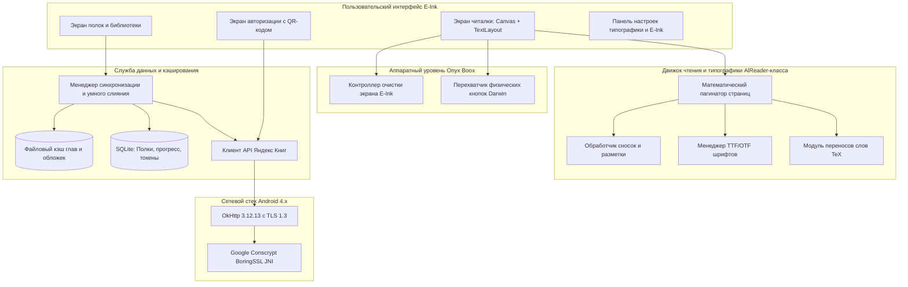

# Архитектурная спецификация: Яндекс Книги Lite для Onyx Boox Darwin (3, 5, 6)

**Дата создания**: 2026-10-01  
**Версия документа**: 1.0.0  
**Статус**: Утверждено в разработку  
**Целевые платформы**: 
- Onyx Boox Darwin 3 (Android 4.2.2 Jelly Bean, API 17, 512 MB RAM, Rockchip RK3026)
- Onyx Boox Darwin 5 (Android 4.4.4 KitKat, API 19, 1 GB RAM, Rockchip RK3128)
- Onyx Boox Darwin 6 (Android 4.4.4 KitKat, API 19, 1 GB RAM, Rockchip RK3128)

---

## 1. Цели и назначение проекта

Создание автономного легковесного Android-приложения (`.apk`), обеспечивающего полноценное чтение книг из сервиса «Яндекс Книги» (ранее «Букмейт») по подписке Яндекс Плюс и из личной библиотеки пользователя на устаревших электронных книгах ONYX BOOX серии Darwin.

### Ключевые требования:
1. **Экстремальная легковесность**: потребление RAM не более 25–35 МБ (стабильная работа в условиях жесткого лимита 512 МБ ОЗУ на Darwin 3).
2. **Работа на устаревших версиях Android**: полная совместимость с `minSdkVersion 17` без зависимости от Google Play Services.
3. **Современная сетевая безопасность**: поддержка TLS 1.2 и TLS 1.3 на уровне Android 4.2/4.4 через Google Conscrypt (BoringSSL).
4. **Удобная авторизация на E-Ink**: OAuth Device Code Flow (подтверждение через смартфон по QR-коду или короткому коду на `ya.ru/device`).
5. **Все режимы чтения**:
   - Потоковое онлайн-чтение по главам.
   - Фоновое автокэширование книги в память при открытии.
   - Ручное скачивание для 100% офлайн-чтения без Wi-Fi.
6. **Умная синхронизация прогресса (Smart Conflict Resolution)**: отсутствие слепой перезаписи прочитанных страниц при параллельном чтении со смартфона/ПК.
7. **Аппаратная адаптация под E-Ink**:
   - Перехват боковых аппаратных кнопок листания (`KEYCODE_PAGE_UP/DOWN`, `KEYCODE_VOLUME_UP/DOWN`).
   - Настраиваемый сброс остаточных артефактов (ghosting) через EPD-драйвер.
   - Сенсорные зоны тапов и отсутствие скролл-анимаций.
8. **Типографика уровня AlReader**:
   - Алгоритм переноса слов TeX Hyphenation (русский и английский языки).
   - Выравнивание по ширине (Justify) без неестественных пробелов.
   - Поддержка пользовательских шрифтов (`.ttf`/`.otf`), настройка межстрочных и абзацных интервалов, полей.
   - Инлайн-сноски прямо на текущей странице.

---

## 2. Общая архитектура системы

---

## 3. Детальное описание модулей

### 3.1. Сетевой уровень (`core-network`)
* **Проблема**: Android 4.2/4.4 использует системный криптопровайдер на базе старого OpenSSL, в котором отсутствуют шифры GCM/ChaCha20 и поддержка TLS 1.3. При прямом запросе к `passport.yandex.ru` возникает `SSLHandshakeException`.
* **Решение**:
  - Инициализация `Conscrypt.newProvider()` при старте `Application.onCreate()`.
  - Сборка и внедрение нативной библиотеки `libconscrypt_jni.so` под архитектуру `armeabi-v7a`.
  - Настройка `OkHttpClient`:
    - Использование кастомного `SSLSocketFactory` с включением протоколов TLSv1.2 и TLSv1.3.
    - Пул соединений: 5 соединений с таймаутом жизни 5 минут.
    - Дисковый кэш HTTP ответов: 10 МБ.

### 3.2. Авторизация (`feature-auth`)
* **Протокол**: Yandex OAuth Device Code Flow (`https://oauth.yandex.ru/device/code`).
* **Шаги**:
  1. Запрос `client_id` $\to$ получение `device_code`, `user_code`, `verification_url` (`ya.ru/device`), `interval` (5 сек).
  2. Генерация черно-белого QR-кода размером 300x300 px через оптимизированную библиотеку ZXing Core.
  3. Отрисовка на экране: QR-код, текстовый код крупным шрифтом (например, `ABCD-1234`), инструкция.
  4. Фоновый опрос эндпоинта `https://oauth.yandex.ru/token` до получения `access_token` или истечения таймаута (10 мин).
  5. Сохранение токенов в зашифрованной таблице `auth_tokens` в SQLite.

### 3.3. Модель данных и API Яндекс Книг (`core-api`, `core-storage`)
* **Эндпоинты**:
  - `GET /api/v2/users/me/books/reading` — полка «Читаю сейчас».
  - `GET /api/v2/users/me/books/to_read` — полка «Буду читать».
  - `GET /api/v2/users/me/books/done` — полка «Прочитано».
  - `GET /api/v2/books/{uuid}` — метаданные книги и оглавление.
  - `GET /api/v2/books/{uuid}/chapters/{chapter_id}` — контент главы.
  - `POST /api/v2/books/{uuid}/progress` — отправка прогресса чтения.
* **База данных SQLite (`library.db`)**:
  - Таблица `books`: `id`, `uuid`, `title`, `author`, `cover_path`, `total_chapters`, `shelf_type`, `is_cached`, `updated_at`.
  - Таблица `chapters`: `id`, `book_uuid`, `chapter_index`, `title`, `file_path`, `is_downloaded`.
  - Таблица `progress`: `book_uuid`, `chapter_index`, `page_index`, `percent`, `sync_timestamp`, `is_synced`.

### 3.4. Алгоритм умной синхронизации (Smart Conflict Resolution)
1. При включении Wi-Fi или открытии книги приложение запрашивает статус из облака Яндекса.
2. Сравниваются 4 параметра: `local_timestamp`, `remote_timestamp`, `local_percent`, `remote_percent`.
3. **Ветвление**:
   - `local_percent > remote_percent` И `local_timestamp >= remote_timestamp` $\to$ отправка локальной позиции на сервер.
   - `remote_percent > local_percent` И `remote_timestamp > local_timestamp`:
     - Если пользователь находится на книжной полке $\to$ автообновление прогресса на карточке.
     - Если книга открыта прямо сейчас $\to$ показ модального диалога:
       *«На другом устройстве прочитано больше: Глава N, X% (от [Время]). Перейти к новой позиции или остаться на текущей?»*
   - Кнопки: **[Перейти]** / **[Остаться]**.

### 3.5. Движок чтения и типографики (`feature-reader`, `reader-typography`)
* **Отказ от WebView**: Полный отказ в пользу нативной отрисовки на `Canvas` с использованием легковесных структур строк и абзацев.
* **Алгоритм пагинации**:
  1. Текст главы загружается в память и нормализуется.
  2. Текст разбивается на токены (слова, знаки препинания, маркеры сносок).
  3. К каждому слову длиннее 4 букв применяется алгоритм переноса Франклина-Ляна (словари TeX для `ru` и `en`).
  4. Строки компонуются под точную ширину экрана за вычетом полей: `available_width = screen_width - padding_left - padding_right`.
  5. Для каждой строки рассчитывается межсловный интервал для точного выравнивания по ширине (Justify).
  6. Высота страницы рассчитывается с учетом `screen_height - padding_top - padding_bottom - status_bar_height`.
* **Сноски (Footnotes)**:
  - При парсинге тегов сносок создаются кликабельные области (`ClickableSpan` / сенсорные прямоугольники).
  - При тапе на сноску всплывает компактное окно (Pop-up) с черной рамкой и белым фоном, содержащее текст сноски, с кнопкой «Закрыть» или закрытием по клику вне окна.
* **Кастомизация AlReader**:
  - Каталог шрифтов: сканирование `/system/fonts/` и пользовательской папки `/sdcard/Fonts/`.
  - Настройки: размер шрифта (12–48 pt), межстрочный интервал (90%–180%), абзацный отступ (0–40 pt), поля экрана (5–60 px).

### 3.6. Аппаратный слой Onyx Boox Darwin (`hardware-onyx`)
* **Перехват клавиш**:
  - `onKeyDown(int keyCode, KeyEvent event)` в `Activity`:
    - `KEYCODE_PAGE_UP`, `KEYCODE_VOLUME_UP`, `KEYCODE_DPAD_LEFT` $\to$ перелистывание назад.
    - `KEYCODE_PAGE_DOWN`, `KEYCODE_VOLUME_DOWN`, `KEYCODE_DPAD_RIGHT` $\to$ перелистывание вперед.
    - Долгое нажатие клавиши листания $\to$ принудительный сброс артефактов E-Ink.
* **Сенсорные зоны (Tap Zones)**:
  - 0% .. 30% ширины экрана $\to$ назад.
  - 70% .. 100% ширины экрана $\to$ вперед.
  - 30% .. 70% ширины экрана $\to$ вызов меню настроек и навигации по главам.
* **Управление E-Ink (EPD)**:
  - Каждые N страниц (настраивается: 1, 5, 10, 20) вызывается режим полного обновления `GC16` (full flash) для удаления остаточных следов текста.

---

## 4. План реализации по фазам

| Фаза | Наименование | Содержание работ |
|---|---|---|
| **Фаза 1** | Фундамент: Проект, Сеть и TLS | Структура проекта под Android SDK 17+, интеграция Conscrypt + OkHttp 3.12, Device Code Flow авторизация |
| **Фаза 2** | API Яндекс Книг и Локальное хранилище | Реализация клиента полок, загрузки манифеста и глав, SQLite база данных и кэш-менеджер (все 3 режима) |
| **Фаза 3** | E-Ink Читалка и Навигация | Нативный Canvas-пагинатор, отслеживание тапов и боковых аппаратных кнопок Darwin, EPD-сброс артефактов |
| **Фаза 4** | Умная синхронизация (Smart Sync) | Механизм сравнения временных меток, очереди синхронизации офлайн-чтения, диалог разрешения конфликтов |
| **Фаза 5** | Продвинутая типографика AlReader | Модуль TeX переносов, кастомные шрифты TTF/OTF, инлайн-сноски, выравнивание Justify, тонкие отступы |
| **Фаза 6** | Тестирование и Сборка APK | Сборка автономного APK, верификация на совместимость с Android 4.2/4.4, создание инструкций по установке |
